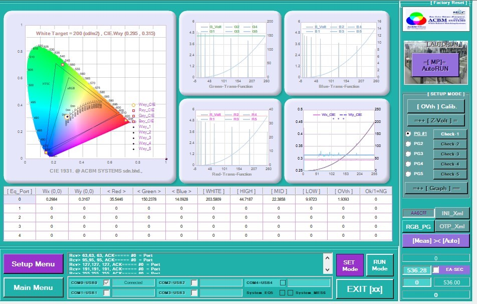
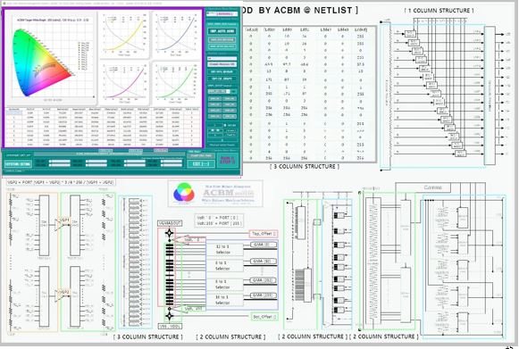
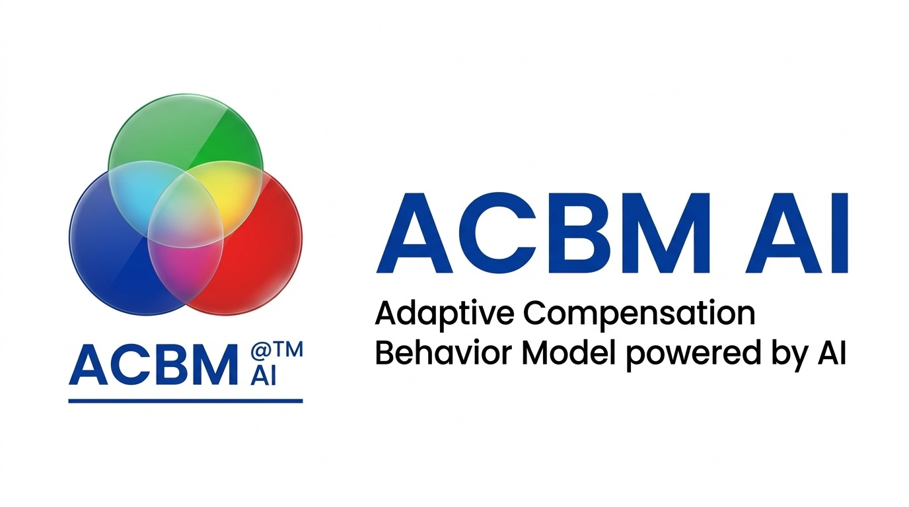
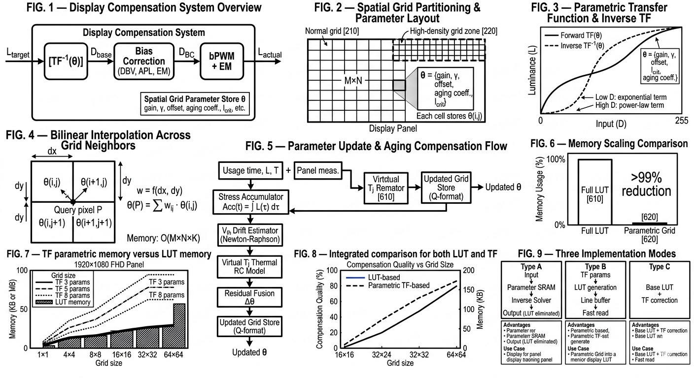
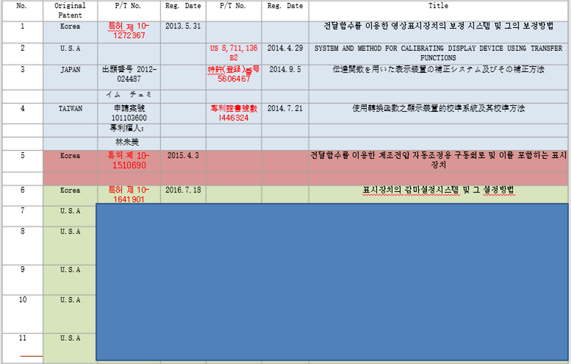

<html lang="en" data-theme="light">
<head>
  <meta charset="utf-8">
  <meta name="viewport" content="width=device-width, initial-scale=1">
  <title>ACBM | Adaptive Compensation-Based Methodology</title> 
  <meta name="description" content="ACBM introduces adaptive compensation methodology for display uniformity, luminance control, and scalable calibration across advanced display systems.">
  
</head>
<body>
  <header class="site-header">
    

      <a class="brand" href="#top" aria-label="ACBM home">
        AI
        ACBM
      </a>
      <nav class="nav-links" aria-label="Primary">
        <a href="#technology">Technology</a>
        <a href="#applications">Applications</a>
        <a href="#ip">IP</a>
        <a href="#contact">Contact</a>
      </nav>
      <a class="btn btn-secondary" href="#contact">Get in touch</a>
    

  </header>

 

  <main id="top">
    <section class="hero">
      

        

          Adaptive Compensation for Advanced Displays
          <h1>Scalable display compensation designed for uniformity, luminance control, and manufacturable calibration.</h1>
          
ACBM introduces a practical methodology for display compensation, with emphasis on real-time correction, reduced memory burden, and implementation paths relevant to OLED, MicroLED, and emerging XR display systems.

          

            <a class="btn btn-primary" href="#technology">Explore technology</a>
                        <a class="btn btn-secondary" href="#ip">View IP focus</a>
          

        

        <aside class="hero-card" aria-label="Highlights">
          
<strong>Core idea</strong>Adaptive compensation

          
<strong>Target domains</strong>OLED · MicroLED · XR

          
<strong>Implementation focus</strong>Calibration + driver architecture

        </aside>
      

    </section>

<iframe
  width="560"
  height="315"
  src="https://www.youtube.com/embed/LOXqIPtEQxk"
  title="YouTube video player"
  allow="accelerometer; autoplay; clipboard-write; encrypted-media; gyroscope; picture-in-picture"
  allowfullscreen>
</iframe>

<!--
<a href="https://youtu.be/LOXqIPtEQxk" target="_blank" rel="noopener noreferrer" class="yt-button">
  Watch on YouTube 1 - Real Test
</a>

-->

    <section id="technology">
      

        <h2 class="section-title">Technology</h2>
        
Parametric Transfer function based LUT-less technology.

        

          

            <h3>What ACBM addresses</h3>
            <ul class="list">
              <li>Grid based uniformity and luminance variation.</li>
              <li>Compensation strategies that remain practical at scale.</li>
              <li>Integration of calibration logic with driver and manufacturing workflows.</li>
              <li>Architecture choices that reduce memory overhead compared with brute-force LUT storage.</li>
            </ul>
          

          

            
          
    
        

      

    </section>

<iframe
  width="560"
  height="315"
  src="https://www.youtube.com/embed/6pty-EGP6hw"
  title="YouTube video player"
  allow="accelerometer; autoplay; clipboard-write; encrypted-media; gyroscope; picture-in-picture"
  allowfullscreen>
</iframe>

<!--    
<a href="https://youtu.be/6pty-EGP6hw" target="_blank" rel="noopener noreferrer" class="yt-button">
  Watch on YouTube 2 - compensation before and after
</a>

-->

    <section id="applications">
      

        <h2 class="section-title">Applications</h2>
        
Advanced display compensation is relevant anywhere panel uniformity, brightness stability, or calibration speed become product bottlenecks.

        

          <article class="feature">
            <h3>OLED panels</h3>
            
Compensation methods can support luminance consistency and panel quality management in high-performance OLED systems.

          </article>
          <article class="feature">
            <h3>MicroLED systems</h3>
            
Fine-pitch MicroLED architectures benefit from scalable calibration approaches where memory and correction speed matter.

          </article>
          <article class="feature">
            <h3>AR and XR displays</h3>
            
Compact near-eye displays demand precise brightness and color management under strict power and area constraints.

          </article>
        

      

    </section>

<!--     

-->

<section id="ip">
  

    
    

      <h2 class="section-title">IP focus</h2>
      
This present patented and patent-pending work, commercialization themes, and partnership opportunities...

      <ul class="list">
        <li>Adaptive compensation methodology.</li>
        <li>Display calibration architecture.</li>
        <li>Memory-efficient correction frameworks.</li>
        <li>Potential licensing and technical collaboration pathways.</li>
      </ul>
    

    

      <h2 class="section-title">Contact</h2>
      
Contact freely for your business needs, please.

      
<strong>Email</strong> acbm@acbmai.de

      
<strong>Location</strong> Frankfurt, Germany

      
<strong>Focus</strong> Display technology, compensation IP, and collaboration inquiries

      <a class="btn btn-primary" href="mailto:acbm@acbmai.de">Email ACBM AI</a>
    

  
 </section>
  
  </main>
  <footer>
    

      
© ACBM AI

      

  </footer>
</body>
</html>
